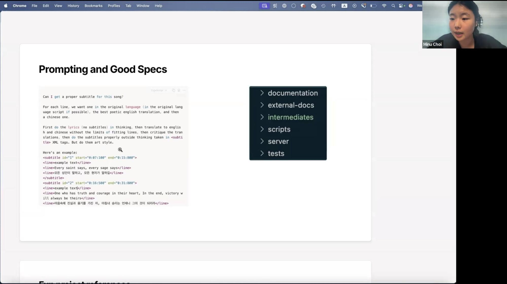
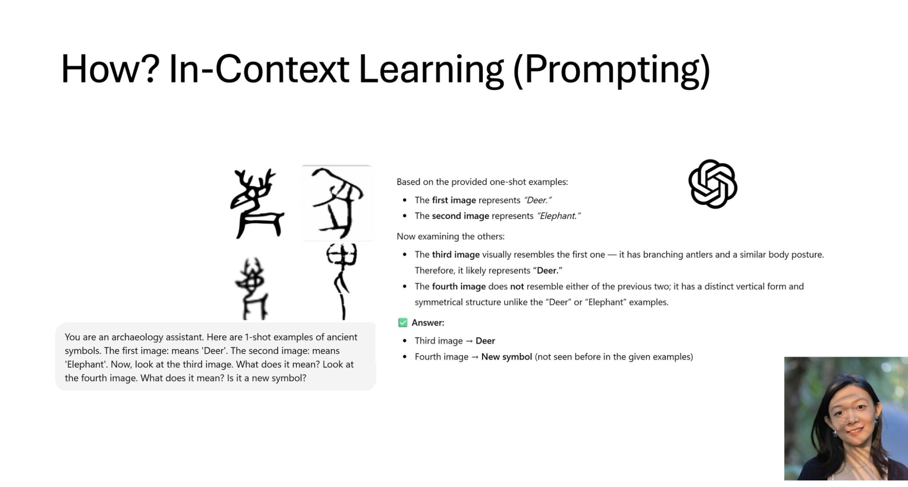
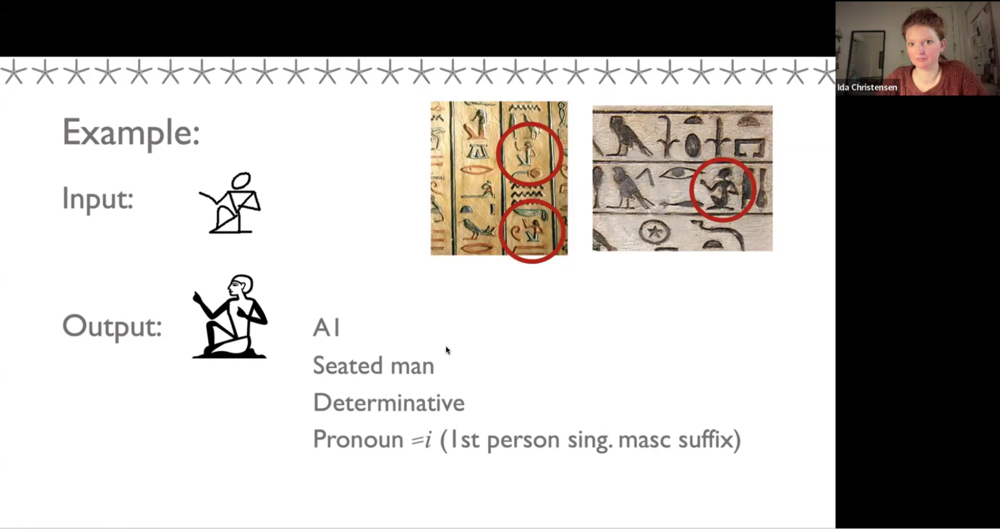
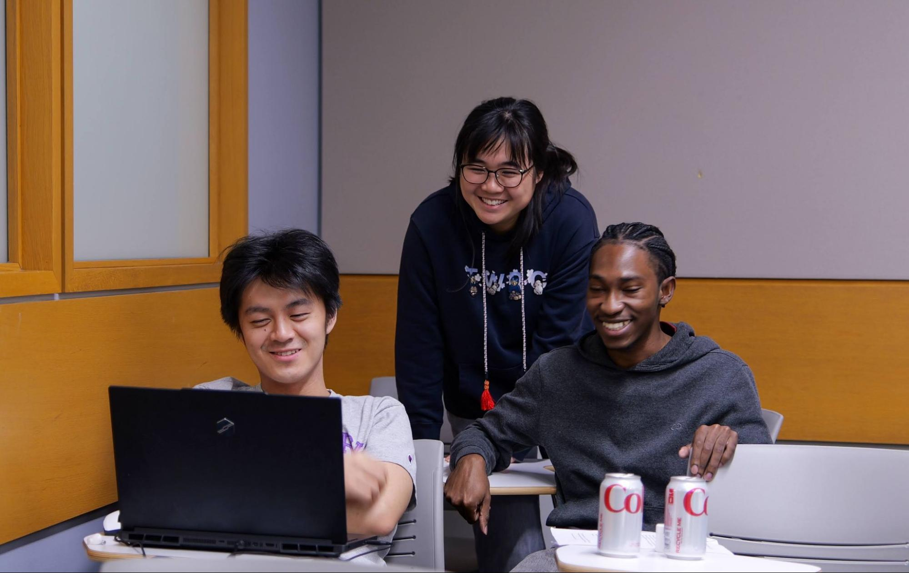
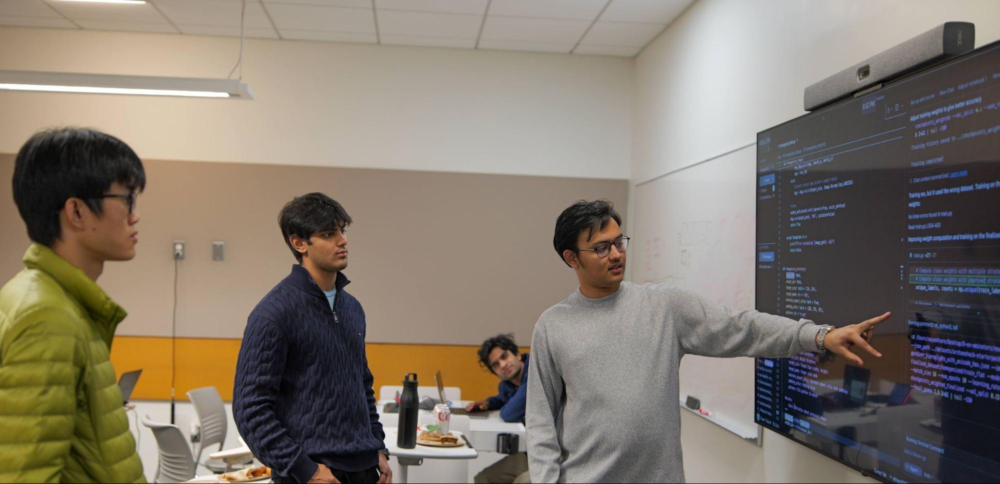
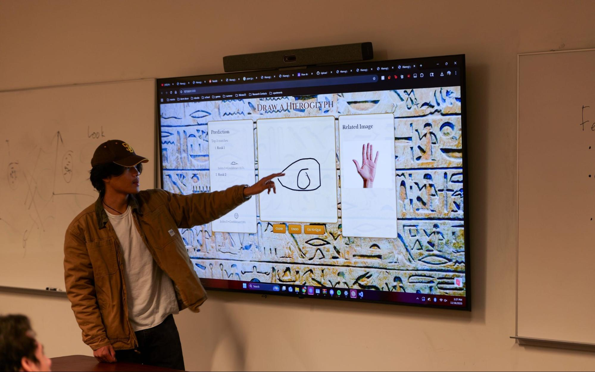
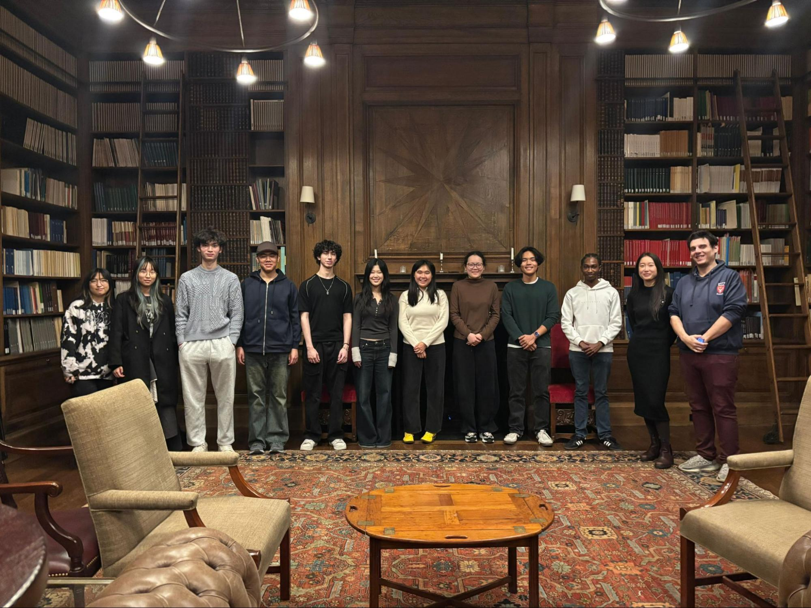

# NYU Undergrads Developed Egyptian Hieroglyph Recognition Applications at ArchaeoHack 2025

*By Tianrui Zhu, Manolis Mavromatis, and Stefano Aprà*

On November 15–16, 2025, the NYU Institute for the Study of the Ancient World (ISAW) hosted **ArchaeoHack 2025**, the first university-level hackathon dedicated to archaeology and the ancient world. The event brought together undergraduate students from across New York University to explore how Machine Learning and Artificial Intelligence can address a long-standing challenge in ancient language studies: the lack of a user-friendly input system for ancient Egyptian hieroglyphs.

This hackathon was designed to be accessible to students from all academic backgrounds and coding skill levels. The majority of the 17 undergraduate participants were STEM majors, though many were freshmen who just took CS101, had no prior hackathon experience, or they have ever developed machine learning projects for real-world applications. To prepare for the hackathon, they took part in three online workshops the week leading up to the competition. The three workshops introduced AI-assisted programming (**[Minu Choi](https://www.linkedin.com/in/%F0%9F%90%B8-minu-choi-2aa642211/)**, co-founder of SouthbridgeAI), machine learning approaches to visual sign recognition (**[Dr. Jing Zhang](https://www.linkedin.com/in/jing-zhang-4b7163285/)**, Tandon), and the fundamentals of ancient Egyptian hieroglyphics (**[Ida Adsbøl Christensen](https://isaw.nyu.edu/people/students/ida-a-christensen)**, ISAW).

> *“Vibe coding” workshop by Minu Choi*

> *Machine Learning workshop by Dr. Jing Zhang*

> *Egyptian hieroglyph workshop by Ida Adsbøl Christensen*

During the two-day competition at the Elmer Holmes Bobst Library, the five teams of undergraduate students worked intensively to design and prototype sign-recognition applications for ancient Egyptian hieroglyphics. They implemented machine learning algorithms, trained and fine-tuned models using NYU’s High Performance Computing resources, and developed app interfaces within a collaborative, fast-paced environment.

Throughout the hackathon, students received guidance from a dedicated group of mentors spanning mathematics, computer science, engineering, and the tech industry. Mentors included **[Dr. Trush Majmudar](https://www.linkedin.com/in/trush-majmudar-03409a13/)** (NYU Courant Institute of Mathematical Sciences), **[Dion Ho](https://www.linkedin.com/in/dion-ho-3b5299341/)** (PhD candidate, Columbia University), **[Felicia Tan](https://feliciatan.co/)** (PhD candidate, NYU Tandon School of Engineering), **[Dr. Ashish Kumar](https://www.linkedin.com/in/ashishntu/)** (Machine Learning PhD and AI startup founder), and **[Ruslan Ibragimov](https://www.linkedin.com/in/ruslan-ibragimov-33576519/)** (Applied Scientist, Amazon Ads). With their help, participants engaged deeply with machine learning concepts—model architectures, encoders, and training strategies—while also grappling with the variability and ambiguity inherent in ancient writing systems such as Egyptian hieroglyphs.

> *Team “Still Loading” working on their app.*

> *Team “D(en)ominator” demonstrating model architecture to Dion Ho, hackathon mentor.*

> *Team “Green” demonstrating interface design*

At the conclusion of the hackathon, teams presented their projects to a panel of judges who are Egyptologists, digital humanities experts, STEM professors and PhD students, and tech industry professionals. Projects were evaluated based on functionality, user experience, documentation quality, scalability and innovation. The top prize was awarded to **Team 3A1W**, whose members—**Mazen Henderson, Kevin Liu, Hansel Chen, and Henry Wang**—impressed the judges with their minimalistic app that can recognize most unilateral hieroglyphs accurately. 

> *Team “3A1W” won the top prize.*

> *ArchaeoHack2025 participants and organizers at the award ceremony.*

ArchaeoHack 2025 is organized by ISAW PhD students **[Tianrui Zhu](https://isaw.nyu.edu/people/students/tianrui-zhu)**, **[Manolis Mavromatis](https://isaw.nyu.edu/people/students/manolis-mavromatis)**, and **[Stefano Aprà](https://isaw.nyu.edu/people/students/stefano-apra)**. ISAW PhD candidate **[Ida Adsbøl Christensen](https://isaw.nyu.edu/people/students/ida-a-christensen)**, Research Associate Professor **[Dr. Patrick Burns](https://isaw.nyu.edu/people/staff/patrick-burns)**, and other ISAW faculty, staff, and students have generously contributed to the programming and logistics. The event is co-sponsored by ISAW and **[NYU ArchaeoHub](https://wp.nyu.edu/archaeohub/)**, and is supported by **NYU Arts & Science Office of Teaching Excellence and Innovation**, **NYU Libraries**, and **NYU IT**. 

> *ArchaeoHack organizers Stefano Aprà, Tianrui Zhu, and Manolis Mavromatis (left to right).*

A crucial component of the hackathon’s success was the preparation of high-quality data infrastructure and computing environment in advance of the event. **[Marii Nyrop](https://www.linkedin.com/in/m-nyrop/)**, Senior Research Data Engineer at NYU Data Services, created a curated hieroglyphics database that served as the foundation for all team projects. The event was further supported by the NYU High Performance Computing (HPC) team, who allocated GPU resources specifically for ArchaeoHack 2025. In particular, **Shenglong Wang** of the HPC team created a dedicated container for the hackathon with all required software packages and dependencies pre-installed so that the participants could begin training their models right away.
By bringing together students, scholars, and technologists, ArchaeoHack 2025 demonstrated the value of interdisciplinary collaboration and highlighted new possibilities for applying emerging technologies to the study of the ancient world.

For additional information, please visit the event **[website](https://archaeohack-evfhl.wordpress.com/)** or contact the organizers directly at archaeohack@gmail.com.

